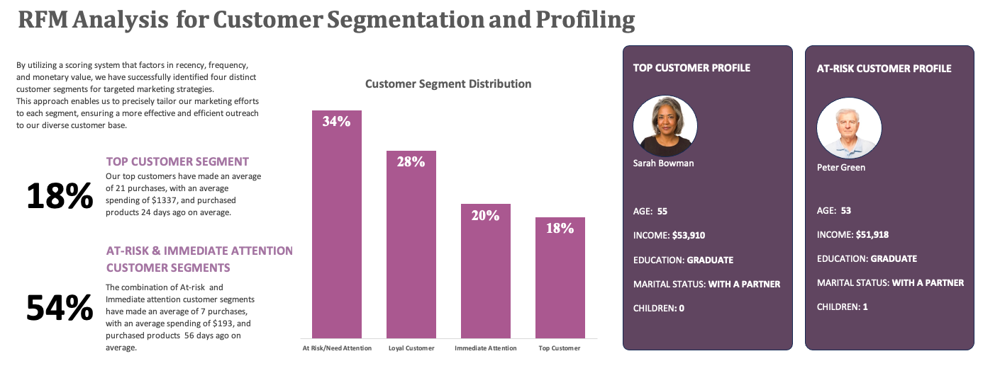

# RFM Analysis for Customer Segmentation and profiling using Excel

This repository contains the code and documentation for the NeighborMart Customer Segmentation Project. The full report and detailed documentation can be found on [Medium](https://medium.com/@okon.judith/rfm-analysis-for-customer-segmentation-and-profiling-using-excel-4b837b49cbcb).

## Project Overview

In a quiet neighborhood, NeighborMart faced a crucial business problem. They had rich customer data but needed to segment their customers for targeted marketing campaigns. The challenge was to distinguish high-value customers from low-engagement ones.

## Business Problem

NeighborMart needed to identify and categorize its customers into four distinct segments based on their buying habits and engagement levels. This segmentation would enable them to create effective marketing strategies tailored to each group.

## Methodology

The project was carried out using Microsoft Excel for data cleaning, analysis, and visualization. Here's a brief overview of the methodology:

1. **Data Cleaning**: Cleaned the dataset by filling in missing values, correcting wrongly spelled values, and removing duplicates.

2. **Data Aggregation**: Created new columns for customer age, total number of children, total monetary value spent, and purchase frequency.

3. **Feature Selection**: Identified and selected relevant features for customer segmentation.

4. **Percentrank**: Created new columns for Percentrank values for Recency, Frequency, and Monetary Value to normalize these metrics.

5. **Create RFM Score**: Calculated an RFM score based on the Percentrank values and created a new column for Percentrank.inc for the RFM score.

6. **Customer Segment**: Created a new column for "Customer Segment" and segmented customers based on the RFM score using VLOOKUP.

7. **Pivot Chart for Customer Segments**: Created a pivot chart displaying the count of customers in each segment.

8. **Visualize and Analyze**: Created visualizations explaining each segment and added key performance indicators (KPIs) including demographic values for the top customers and "Immediate Attention" segment.

## Dataset

The project utilized a dataset from Kaggle containing information on 2,240 customers, organized in 27 columns. These columns include various pieces of information about each customer, including a unique customer ID.

## Recommendations

Based on the analysis, the following recommendations were made for marketing strategies:

**Top Customers**:
1. Exclusive Offers: Provide special offers or discounts exclusively for top customers.
2. Personalized Recommendations: Offer personalized product recommendations based on their purchase history.
3. Priority Support: Offer priority customer support to enhance their loyalty.
4. Loyalty Program: Consider implementing a loyalty program to reward continued patronage.

**At Risk/Need Attention and Immediate Attention Customers Combined**:
1. Re-Engagement Campaign: Launch a re-engagement campaign with special offers or discounts.
2. Feedback Request: Ask for feedback on previous experiences to rekindle interest.
3. Customer Service Outreach: Proactively reach out to address any past issues.
4. Win-Back Offers: Offer attractive win-back offers for customers who haven't made a purchase in a while.

Please refer to the full documentation on [Medium](https://medium.com/@okon.judith/rfm-analysis-for-customer-segmentation-and-profiling-using-excel-4b837b49cbcb) for a detailed overview of the project, analysis, and findings.

